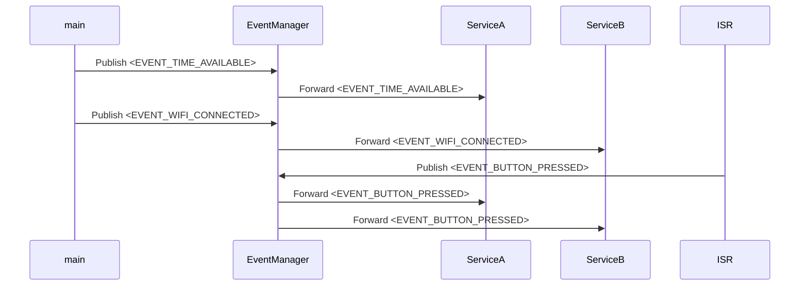

# Basic Service communication

This example is an ESP-IDF-based application that demonstrates the use of event management and FreeRTOS tasks in an embedded system. The project includes two services, ServiceA and ServiceB, which handle different events published by an EventManager. The application also sets up a button interrupt to trigger events.

