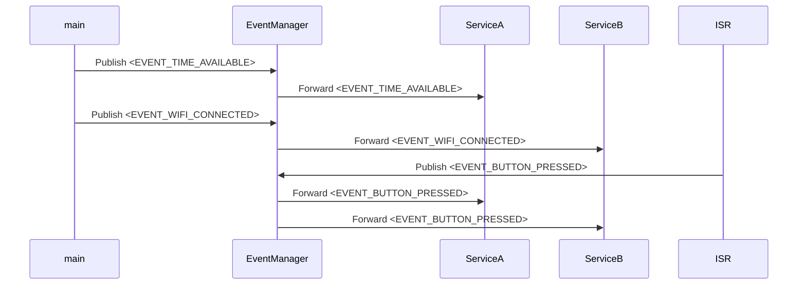

# State machine Service communication

This example demonstrates the use of state machine enabled active objects (services) that handle events.

The project uses a [port](https://github.com/oldrev/esp-idf-smf) of Zephyr SMF (State Machine Framework) for ESP-IDF.

